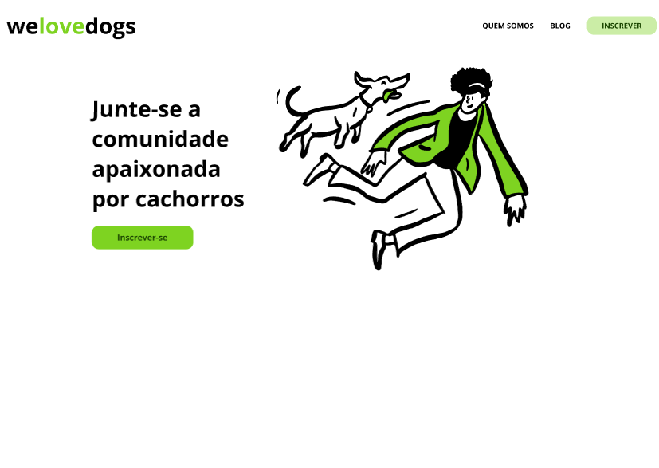

# WeLoveDogs

## Descrição

O projeto **WeLoveDogs** é uma aplicação web estática multipágina, desenvolvida utilizando HTML e CSS. Ela tem como objetivo apresentar o grupo social **WeLoveDogs**, com informações sobre o grupo e um blog para os visitantes interagirem. A aplicação é composta por quatro páginas: **Home**, **Quem Somos**, **Blog** e **Contato**. A navegação entre as páginas é feita através de um menu intuitivo, garantindo uma experiência de usuário simples e direta.

## Funcionalidades

- **Home:** Apresenta uma visão geral sobre o grupo social **WeLoveDogs**, com links rápidos para as outras páginas.

- **Quem Somos:** Exibe informações detalhadas sobre o grupo, sua missão e história.
- **Blog:** Apresenta posts sobre o grupo e suas atividades, com conteúdo dinâmico e interessante para os visitantes.
- **Contato:** Permite que os visitantes entrem em contato com o grupo, oferecendo um formulário de contato.

## Requisitos Implementados

- As páginas **Home**, **Quem Somos**, **Blog** e **Contato** estão completas e implementadas conforme o design proposto no **mockup**.
- Todos os links de navegação (no menu e no botão da home) redirecionam corretamente para as páginas correspondentes.
- A logo da página redireciona para a **Home**.
- O layout é responsivo e ajustado para diferentes tamanhos de tela.
- Animações adicionadas, como efeitos de **hover** nos links, proporcionando uma experiência de navegação mais interativa.

## Como Usar

1. Clone este repositório no seu computador.
2. Abra o arquivo `Home.html` em um navegador para visualizar a aplicação.
3. Navegue pelas páginas usando o menu de navegação.
